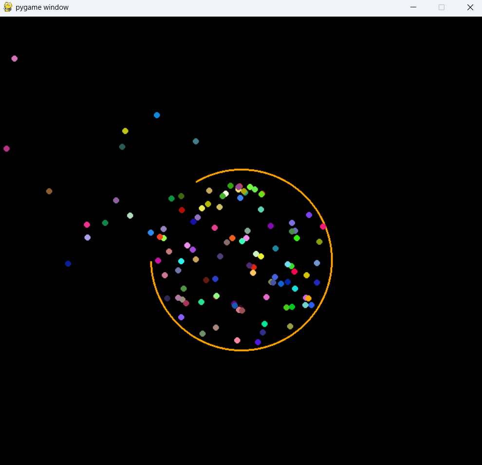

# 🎮 Ball Simulation with Rotating Arc (Pygame)

This project is a simple **physics-based simulation** built with **Pygame** and **NumPy**.  
It visualizes bouncing balls inside a circular boundary with a rotating arc (gap).  
When a ball escapes through the arc, new balls are spawned at the center.

---

## 🧩 Features

- Realistic **gravity and reflection** effects.
- A **rotating arc** (gap) allows balls to escape.
- Balls are **randomly colored** and move with random initial velocities.
- Automatically **respawns** new balls when any leave the screen.

---

## 🖥️ Requirements

You need to have **Python** installed on your system.

Then install the required libraries:

```bash
pip install pygame numpy
```

## 🚀 How to run
1. Clone the repository:
```bash
git clone https://github.com/NgocDungK68/BallBounce.git
cd BallBounce
```


2. Run the program:
```bash
python ball.py
```

3. A window will open showing:
- An orange circle (the boundary).
- A rotating black arc (the exit gap).
- Balls bouncing inside the circle and escaping through the arc.

## 📸 Preview



## 🧩 Dependencies Summary
| Library | Purpose |
|----------|----------|
| `pygame` | Graphics rendering and game loop |
| `numpy`  | Vector math and position updates |
| `math`   | Trigonometric calculations |
| `random` | Random velocity and color generation |

## 📚 Reference

This project is originally created by [Dũng Lại Lập Trình](https://www.youtube.com/@dunglailaptrinh).  
If you use or modify this code, please give proper credit by linking back to the original repository.